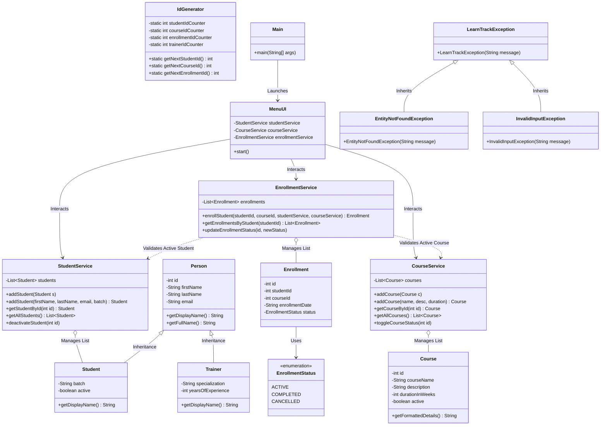

# LearnTrack - Core Java Student & Course Management System

LearnTrack is a modular, console-based Student & Course Management System built with **Core Java**. It provides an interactive administrative dashboard to manage Students, Courses, and Enrollments while demonstrating foundational Java concepts (OOP design, collections, packages, static utilities, custom exception handling, and documentation).

---

## 🌟 Key Features

### 👨‍🎓 1. Student Management
- Add new students using overloaded constructors.
- View all registered students with batch and active status details.
- Search students by unique ID.
- Deactivate/Reactivate students (soft delete flag).
- Update student information.

### 📚 2. Course Management
- Add new courses with duration (in weeks) and detailed descriptions.
- View all available courses.
- Search courses by unique ID.
- Toggle active/inactive status for courses.

### 📝 3. Enrollment Management
- Enroll active students in active courses (validates active status and checks duplicate enrollments).
- View all course enrollments for a specific student.
- Update enrollment status (`ACTIVE`, `COMPLETED`, `CANCELLED`).
---

## 📊 Class Diagram & Architecture Relationships



---

## 📁 Package & Directory Structure

```
LearnTrack/
├── docs/
│   ├── Setup_Instructions.md    # IDE setup, compiler flags, and CLI execution guide
│   ├── JVM_Basics.md            # JDK vs JRE vs JVM, bytecode, and WORA concepts
│   └── Design_Notes.md          # Rationale for ArrayList, Static counters, and Inheritance
├── src/
│   └── com/
│       └── airtribe/
│           └── learntrack/
│               ├── entity/
│               │   ├── Person.java            # Base class demonstrating inheritance
│               │   ├── Student.java           # Extends Person (batch, active, getDisplayName)
│               │   ├── Trainer.java           # Extends Person (specialization, experience)
│               │   ├── Course.java            # Course entity class
│               │   ├── Enrollment.java        # Enrollment entity class
│               │   └── EnrollmentStatus.java  # Enum (ACTIVE, COMPLETED, CANCELLED)
│               ├── exception/
│               │   ├── LearnTrackException.java      # Base custom exception
│               │   ├── EntityNotFoundException.java # Thrown when entity lookup fails
│               │   └── InvalidInputException.java   # Thrown on business logic/validation failure
│               ├── util/
│               │   ├── IdGenerator.java        # Static counter utility
│               │   └── InputValidator.java     # Console reader helper for safe inputs
│               ├── service/
│               │   ├── StudentService.java     # In-memory student operations (ArrayList)
│               │   ├── CourseService.java      # In-memory course operations (ArrayList)
│               │   └── EnrollmentService.java  # Enrollment rules & status updates
│               ├── ui/
│               │   └── MenuUI.java             # Menu-driven console UI
│               └── Main.java                   # Application entry point
└── README.md
```

---

## 🚀 How to Compile and Run

### Running in IntelliJ IDEA
1. Open IntelliJ IDEA and choose **File -> Open...** -> select the `LearnTrack` folder.
2. Ensure `src/` is marked as **Sources Root** (Blue folder).
3. Open `src/com/airtribe/learntrack/Main.java`.
4. Click **Run 'Main.main()'** or press `Shift + F10`.

### Running via Terminal / CLI
```cmd
# 1. Navigate to project root
cd "e:\airtribe projects\LearnTrack"

# 2. Compile source files into bin directory
mkdir bin
javac -d bin src\com\airtribe\learntrack\*.java src\com\airtribe\learntrack\entity\*.java src\com\airtribe\learntrack\service\*.java src\com\airtribe\learntrack\ui\*.java src\com\airtribe\learntrack\util\*.java src\com\airtribe\learntrack\exception\*.java

# 3. Run application
java -cp bin com.airtribe.learntrack.Main
```

---

## ✨ Clean Code Practices

LearnTrack strictly follows clean code principles:
- **Meaningful Method Names**: Explicit, self-describing methods such as `addStudent`, `getStudentById`, `addCourse`, `getCourseById`, `enrollStudent`, `deactivateStudent`, and `updateEnrollmentStatus` instead of generic names like `doWork` or `fun1`.
- **Small & Focused Methods**: Methods are kept concise with a single responsibility (e.g. separation between entity state, service business logic, and UI console rendering).
- **Separation of Concerns**: Entities represent data models (`com.airtribe.learntrack.entity`), services manage collections and logic (`com.airtribe.learntrack.service`), and UI manages user interactions (`com.airtribe.learntrack.ui`).

